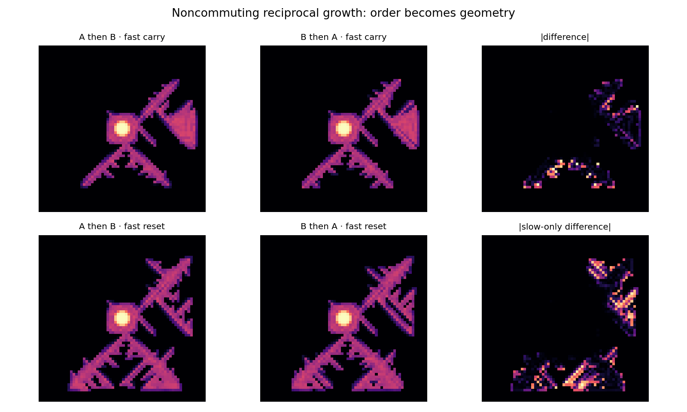

# Morphogenetic Geometric Neuron v0.2

> **A complex pulse field grows reciprocal structure from its own history, while a separate directed-link memory can store local transport arrow. The grown body is then frozen and asked to process through what it built.**

PerceptionLab / Antti Luode + ChatGPT GPT-5.6 Sol, August 2026.

> Do not hype. Do not lie. Just show.

---

## Why v0.2 exists

v0.1 fused the Geometric Neuron with PhaseStigmergy, but it carried four weaknesses that later cross-audit exposed:

1. growth could stop halfway through a stimulus cycle, so a mass threshold changed **which patches were presented**;
2. patch identity was tied to absolute carrier phase;
3. the local arrow was stored as a scalar `M_A` and only became directional through its gradient;
4. the explicit complex Euler step had no hard stability guard.

The independent Claude implementation found the same family of problems from another direction. v0.2 rebuilds the experiment around the fixes.

---

# The state

```text
psi(y,x,t)       fast complex activity
M_S(y,x)         slow reciprocal structural memory / grown body
theta_x(y,x)     slow signed phase on horizontal directed links
theta_y(y,x)     slow signed phase on vertical directed links
```

`M_S` changes only **positive symmetric conductivity**. It can remember where history grew paths, but it does not make a fixed link one-way.

`theta_x/theta_y` are a different object. Reverse links carry the conjugate phase, and the gauge-invariant local arrow is the loop sum around a plaquette. This is the `Nuoli` lesson brought into morphogenesis: a real local arrow belongs on directed links/cycles, not in a scalar whose gradient may be trivial.

---

# The central correction: one reciprocal memory can still store order globally

A fixed reciprocal medium cannot manufacture local directional transport merely from passive geometry. That old V13 lesson still stands.

But **development is not a fixed operator**.

If stimulus `i` causes a slow update `F_i` of the body, then even when every instantaneous field operator is reciprocal,

```text
F_B(F_A(M))
```

need not equal

```text
F_A(F_B(M)).
```

The first experience changes the substrate on which the second experience acts.

That is the clean mechanism behind **global order fossilisation**:

> **locally time-even physics + noncommuting plasticity = order-dependent final geometry.**

No local gauge field is required for that statement.



`experiments/exp_noncommuting_growth.py` measures this directly rather than inferring it from a classifier.

A small CPU audit used while building v0.2 gave:

```text
N=48, dwell=12, two A/B repetitions, 8 substrate seeds

A->B versus B->A morphology distance
  fast field allowed to carry between visits : 0.2196 ± 0.0858
  fast field RESET at every visit             : 0.0817 ± 0.0851
  stimulus-blind growth null                  : 0.0000 exactly
```

The reset-fast arm is important: some noncommutativity survives after `psi` and its history are erased between visits. The first **slow structural write itself** changes what the second visit grows into. That is stigmergic developmental memory in the literal implementation.

### What this does **not** establish

In this implementation, the current strict four-patch **soma readout has not yet shown a functional sequence preference beyond the noise floor**. Order definitely changes the body; this repo has not yet shown that those particular body differences are useful to the present soma probe.

The independent Claude implementation *has* reported a clean equal-dose `M_S` preference after fixing the stopping/carrier confounds. That cross-implementation difference is now a scientific question, not something to smooth over. See `docs/LEDGER_2026-08-07.md`.

---

# Strict order-fossil experiment

Training is now an integer number of complete cycles:

```text
forward : 0 -> 1 -> 2 -> 3
reverse : 0 -> 3 -> 2 -> 1
```

Every patch receives exactly

```text
cycles × dwell
```

frames in both arms.

The carrier phase restarts from the same phase at every patch visit.

So the only intended difference is **event order**.

Run:

```bash
python experiments/exp_order_fossil.py --seeds 8 --mode symmetric
```

The script reports:

- forward-trained and reverse-trained `dR`;
- signed learned effect;
- bias term;
- seed spread;
- exact sign-flip p;
- random-order spread;
- forward/reverse morphology mirror diagnostics;
- a painted-asymmetry positive control showing whether the soma probe can see a strong reciprocal asymmetry at all.

A nonzero number by itself is never called a result.

---

# The local arrow channel

v0.2 retires scalar `M_A` as the main arrow representation.

For each oriented edge:

```text
theta_ij = -theta_ji
```

and the complex field evolves through a Peierls/covariant nearest-neighbour operator:

```text
L psi_i = sum_j K_ij [ exp(i chi theta_ij) psi_j - psi_i ]
```

The operator remains Hermitian in the link geometry; local time-reversal breaking is carried by non-removable loop phase, measured as plaquette flux.

The memory is written from oriented local phase current:

```text
J_ij ~ Im( conj(psi_i) exp(i theta_ij) psi_j )
```

rather than from generic amplitude.

This gives a genuine second question:

> Does **local directed transport memory** contribute anything beyond the sequence-selective global morphology already available to `M_S`?

Run:

```bash
python experiments/exp_link_channel.py --seeds 8 --mu-a 0.15 --chis 0 1 2 3 4 6
```

The main mode is `link_noread`: link memory is allowed to be written during growth but cannot alter the wave or morphology while it is being grown. After freezing, the same organism is probed with the links deleted or enabled.

That separates:

```text
same M_S, theta deleted   -> reciprocal morphology alone
same M_S, theta read      -> direct local-arrow contribution
cross-transplant theta    -> does the arrow travel with the links rather than the body?
```

The `chi` sweep asks whether the local channel can add to, cancel, or reverse the global morphological preference.

---

# Numerical guards

`selftest.py` now checks:

- conservative nearest-neighbour operator: constant field -> zero at zero link phase;
- directed link current flips under conjugation;
- a scalar-gradient link field has zero plaquette flux;
- a true directed loop has nonzero flux;
- exact equal per-patch exposure;
- explicit-Euler stability guard;
- exact geometric-centre mirror null;
- clean forward/reverse morphology mirror identity.

Run this first:

```bash
python selftest.py
```

The model refuses to construct if the explicit complex Euler step is outside its conservative stability bound.

---

# Modes

```text
scalar       intensity-gated reciprocal growth
symmetric    time-even lag-support gated reciprocal growth
link         symmetric growth + directed-link write + directed-link read
link_noread  symmetric growth + directed-link write, links disabled during growth
```

`link_noread` is the clean causal arm. `link` is the full closed loop.

---

# Watch it grow

```bash
python run_live.py --mode link --device cuda
```

Controls:

```text
q   quit
r   reset
d   reverse event order
g   freeze/unfreeze growth
a   toggle directed-link read
s   save capture
```

Panels show:

- fast field amplitude;
- grown `M_S` body;
- gauge-invariant loop flux;
- current growth front.

---

# What the older repos actually contribute

The older work does help, but not in the tidy way the repo names can make it seem after the fact.

- **AgainstTheGrain** — fixed learned trajectories can be expensive/unstable in reverse, and reversal cost depends on the representation. Its `mirror lies` file is *not* today's dose bug; its `substrate decides` file is *not* an earlier proof of `M_S` order memory.
- **Nuoli** — the strongest direct bridge: scalar/1-D phases can be pure gauge; non-removable arrow lives in cycle/plaquette flux. This is why v0.2 moves `M_A` onto links.
- **Ristikko / Kaiku** — the readout must possess the right reference to see the symmetry sector; hidden bias can manufacture an apparent arrow. Hence exact-centre and no-hidden-reference controls.
- **ArrowField / Eromitta** — complex phase/current and gradient frustration are better candidates for a local arrow/write signal than raw intensity; self-slowing/frustration can pin structure.
- **Vino** — skew recurrence can preserve long temporal order in a fixed network. That is complementary to reciprocal `M_S` storing order through development.
- **Tormays** — memory and non-contraction are linked; also, a stray bias can act as a homodyne carrier and fake directional readability.
- **Alavirta** — probably the most important parent for the **next** build: prediction and sensation must meet in the same basis so a residual can guide adaptation.
- **Kolmijako** — methodology: validate the operator, calibrate the meter, preserve the kills.

See `docs/OLD_REPO_BRIDGES.md`.

---

# Where this is going: Functional Arbor

The current machine can grow different bodies from different histories. The hard next step is to make the grown difference land on **paths that matter to the soma**.

The likely missing ingredient is credit assignment, returning to the humble PerceptionLab origin:

```text
local phase/current eligibility
            ×
global soma prediction/resonance error
            ->
slow branch write
```

That is the morphogenetic version of the original homeostatic feedback loop: the pulse does not merely sculpt whatever it touches; paths are stabilized because they improve a global temporal function.

Only after that passes should the same rule be lifted into 3-D and judged as a dendritic arbor.

The 3-D body then has a reason to exist:

> **it is a physical bank of delays and routes grown by the temporal statistics it later processes.**

See `docs/NEXT_BUILD.md`.

---

# Reproduce

```bash
pip install -r requirements.txt
python selftest.py
python experiments/exp_noncommuting_growth.py --seeds 8
python experiments/exp_order_fossil.py --seeds 8 --mode symmetric
python experiments/exp_link_channel.py --seeds 8 --mu-a 0.15 --chis 0 1 2 3 4 6
python run_live.py --mode link
```

MIT.
